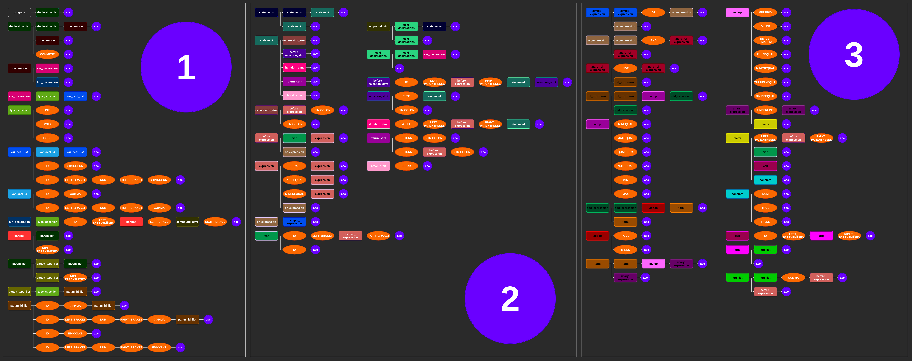

# Introduction
So here is the story.\
I was in college and the master asked me to write a programming language, so I tried my best and created a soooo simple language and wrote down the grammar as a readable and understandable picture.

# How To Compile The Compiler
Note: If you want, you can see this step by step how to use in [presentation.odp](presentation.odp) file too.

## Convert Lexer
1. First we have to convert the written code to a
full C Language file.\
To do this, go in [My Grammar](./My%20Grammer) folder and open up your terminal in that directory and write down: `lex flex.l`
2. After this you should see a new file with this name: `lex.yy.c`\
That’s what we need.
## Convert Parser
1. We have to convert the written code to a full C Language file.\
To do this, go in [My Grammar](./My%20Grammer) folder and open up your terminal in that directory again(or use the previous opened terminal...) and write down: `yacc conf.y -d`
2. After this you should see two new files with these names:
`y.tab.c` and `y.tab.h`
## Compile All Together
1. Again in [My Grammar](./My%20Grammer) folder, in your terminal write down: `gcc lex.yy.c y.tab.c`
2. After this line, gcc compiles the (`lex.yy.c` and `y.yab.c`
and `y.tab.h`) together and creates an executable file that is your compiler, named: `a.out`

# How To Use
Because the output is an executable file, you can simply write `./a.out` and run the compiler and write code as [Grammar](./My%20Grammer/Grammer.jpg) says and see the output.

## Grammer

And at the end, if you want to see the grammar of the language, you can see it here.

# So What Is C-Grammer Folder?

I was trying to create some little more complex programming language based on C Language buy I wasn't so successful in it and it was so much more complex than I expected.\
But i tried my best and if anyone can fix it to solve the conflicts, send me the solution in a pull request.

## The C Grammer

And here you can see the grammar of the language that I was trying to generate and in a single look you can say that it was big shot...

# How To Create A Language

I'm not a guy to say where to start exactly, but I do can help a little.
1. If you are completely unfamiliar with Grammar, sure the first step for you is to start learning how to write grammar and solve conflicts in grammar (I'm not really good at this too obviously).
2. You have to know what lexers and parsers are and how they work together, so try to learn their concepts and understand which grammar is used in lexers ([Regular](https://en.wikipedia.org/wiki/Regular_grammar) grammars) and which in parsers ([Context-free](https://en.wikipedia.org/wiki/Context-free_grammar) grammars).
3. Know the language that you want to go with it. (I chose C Language, you can use whatever you like - I heard you can use python as a lexer and parser generator)
4. Go for it.

## More Stuff

If you chose your target language to be C, make sure to checkout this repository.\
https://github.com/DoctorWkt/acwj

This guy made a huge favor to us.

Hope you all have a nice day. 😊